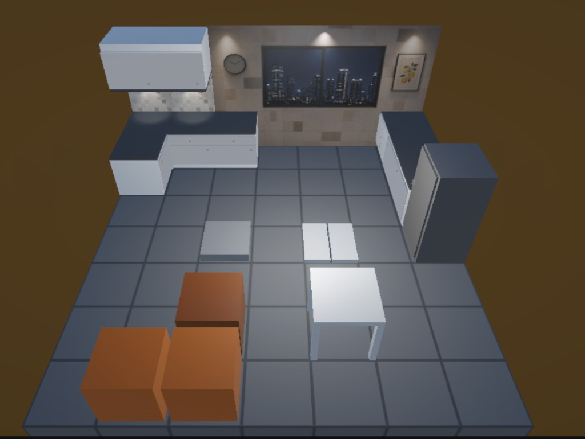

# Development Restarted, Port to Unity

## Summary

The Cat Snake project restarted: gameplay systems from the Rust prototype are landing in Unity, Level 02 is starting to look like a real space, and the game runs on a phone.

# Some Concept Art and Inspiration

I asked ChatGPT to make some concept art, although the cat face is a bit too cute for my taste it helps to get an idea.

# On the technical Side

I've been using Cursor to port the prototype and make sure that the carefully handwritten code is reproduced with good enough quality. Was actually quite impressed by the port made by the agent, with careful guidance.

## Undo system (Rust port)

Ported the event-based undo from the Rust version:

- **Backspace** undoes the last player move on desktop
- Grid diffs, box pushes, falls, food consumption, and void-fall auto-undo are recorded in a move history stack
- Post-port fixes for box push animation, snake fall positioning, and stacked boxes after falls

## Kitchen assets & Level 02

I made those simple kitchen asset a few years ago in Blender, time to use them in the game, now that it has a proper engine!

- Imported kitchen assets as prefabs (cabinets, fridge, clock, window, lighting, etc.)
- Rebuilt **Level 02** around a kitchen layout: tiled floor, textured back wall, window with city view, countertop runs, and table props
- Tuned materials (e.g. kitchen wall texture scale) and camera framing for the isometric view

## Android port

First playable builds on device:

- **IL2CPP stable** build (`CatSnake-dev.apk`) for release-like testing on ARM64
- **Mono quick** build (`CatSnake-dev-mono.apk`) for faster iteration during development
- Shell scripts and Editor menu items for build/install; README with setup notes
- Landscape-only orientation, dev package id `com.oilandrust.catsnake.dev`

## Touch input & undo UI

- **Swipe controls:** horizontal swipes move on X, vertical swipes on Z — same semantics as arrow keys, including “go up over wall” when blocked
- **Undo button** in the top-right on Android and desktop; Backspace still works on keyboard
- Swipes ignore touches that start on UI so the undo button doesn’t accidentally move the snake